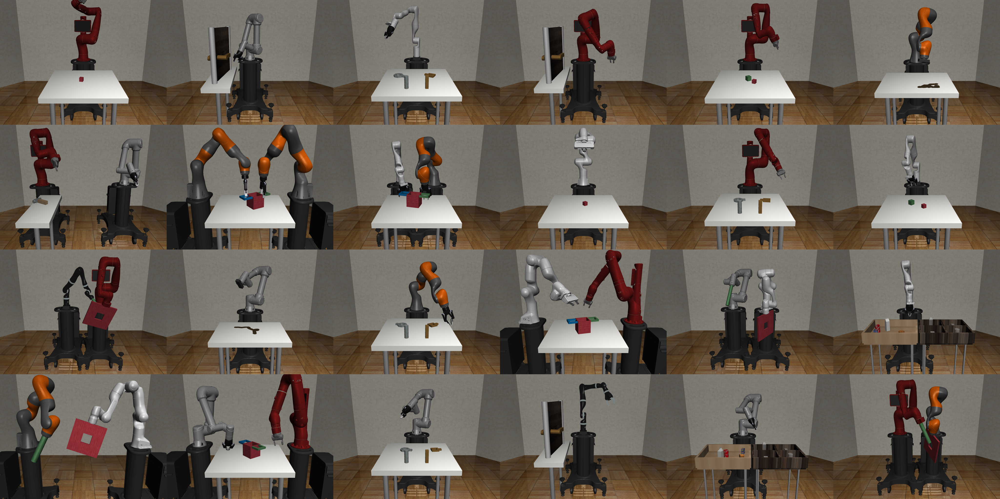

# robosuite v1.3 with LRmate



-------
## Latest Updates
[01/17/2023] **MSC Version**: Add Operational Space Admittance Controller

[01/13/2023] **MSC Version**: Add FANUC LRmate support for MSC Lab

[10/19/2021] **v1.3**: Ray tracing and physically based rendering tools :sparkles: and access to additional vision modalities 🎥

[02/17/2021] **v1.2**: Added observable sensor models :eyes: and dynamics randomization :game_die:

[12/17/2020] **v1.1**: Refactored infrastructure and standardized model classes for much easier environment prototyping :wrench:

-------
## Installation

1. Download MuJoco 2.1.0 or 2.0.0

2. Install mujoco_py from source (Notice robosuite v1.4 does not works with openai mujoco_py): 
  ```cd mujoco_py``` and  ```pip install -e .```

3. Install robosuite from source (carefully check the mujoco_py version in setup.py): 
  ```pip install -r requirments.txt```

4. Install rlkit from source (support python 3.7) (carefully check the mujoco_py version in setup.py):
  ```pip install -r requirments-rlkit.txt```

5. Install torch and torch vision based on the cuda version
```pip install torch torchvision torchaudio --extra-index-url https://download.pytorch.org/whl/cu116```

6. Install rlkit from source:
  ```cd rlkit``` and ```pip install -e .```

7. Demo: ```python robosuite/demos/demo_control.py```

--------
## Troubleshooting
export LD_LIBRARY_PATH=$LD_LIBRARY_PATH:/home/fanuc/.mujoco/mujoco200/bin/
export MUJOCO_PATH=/home/fanuc/.mujoco/mujoco200/
export MUJOCO_LICENSE_PATH=/home/fanuc/.mujoco/mujoco200/bin/mjkey.txt
export LD_PRELOAD=/usr/lib/x86_64-linux-gnu/libGLEW.so